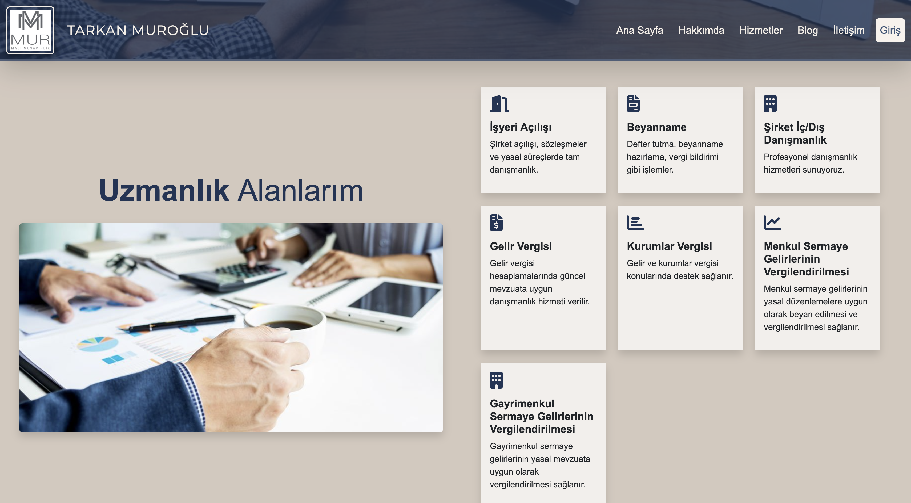

# Kişisel Web Sitesi

Bu proje, modern, responsive (mobil uyumlu) bir **muhasebe ve mali müşavirlik tanıtım web sitesidir**. HTML, CSS ve Bootstrap 5 kullanılarak geliştirilmiştir.

## 🚀 Özellikler

- Şık ve kullanıcı dostu arayüz  
- Mobil uyumlu responsive tasarım    
- Hizmet kartları ile görsel anlatım  
- Blog içerikleri bölümü  
- İletişim formu  
- FontAwesome ve Bootstrap ikonları desteği  

## 🛠️ Kullanılan Teknolojiler

- HTML5  
- CSS3  
- Bootstrap 5  
- FontAwesome 6  
- Google Fonts (Montserrat, Inter)  


## 🚀 Kurulum ve Çalıştırma

1. Repostory'i klonlayın:
   ```bash
   git clone https://github.com/kullanici-adi/proje-adi.git
2. Klasöre gidin:
    ```bash
    cd proje-adi
3. index.html dosyasını destekleyen herhangi bir web tarayıcısında açın veya VSCode gibi editörlerde Live Server eklentisi ile çalıştırın.

## 📷 Ekran Görüntüsü
### Anasayfa Görünümü

### Responsive Menü (Mobil)


## 📝Lisans
Bu proje açık kaynaklıdır. İstediğiniz şekilde kullanabilir, geliştirebilir ve paylaşabilirsiniz. Kaynak gösterilmesi önerilir.
